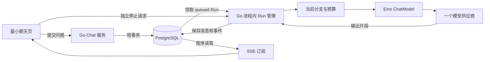

# 无查找工具聊天主链路：完整目标规格与实施规划

日期：2026-09-19。状态：Shape 方案草案，待后续实施确认。本文件描述目标行为，不能视为当前已具备的功能。

## 1. 结论与开发范围

最先补齐的是持久化与运行控制，再连接模型流，随后提供可恢复的 SSE 与最小聊天页。只有“能返回一段模型文本”还无法满足项目已经写明的刷新恢复、停止、幂等和回答版本要求。

本阶段执行链：



Go、PostgreSQL 和一个可用模型足以跑通该阶段。Python、Neo4j、pgvector、文件解析、Tavily 无需成为聊天启动依赖。最终产品的 Go / Python 分工与四路检索目标不变；这里仅安排实现先后，不重建 M0～M4 发布分期。

推荐包含：会话 CRUD、纯文本多轮流式聊天、停止、恢复、末尾问题重新生成与回答版本、基本模型选择与配置快照、上下文裁剪、最小运行详情、最小 React 页面。

推荐暂不包含：项目管理和项目说明编辑、任何检索与工具、知识库、引用、Agent、多模态、历史问题编辑、分支树导航、摘要、长期记忆、自动命名、公开账号系统。

## 2. 仓库现状与差距

以下是源码调查结果，未通过运行功能验证：

| 部分 | 已有事实 | 下一步 |
|---|---|---|
| 启动与 HTTP | `cmd/server/main.go` 手工注入；`router.go` 只有 `/health` 与会话列表 | 增加数据库与后台任务生命周期、聊天接口 |
| 会话 | `UnavailableConversations` 占位；handler 尚未填可信 UserID | 接真实仓储与身份入口 |
| 领域对象 | Message 只有角色、正文和时间；Run 只有会话、状态和时间 | 增加父子关系、输入输出关联、幂等键、模型快照、序号和终态信息 |
| 服务接口 | Conversation 有 CRUD 契约；Message / Run 只有读取 | 定义发送、重新生成、停止、快照和事件读取用例 |
| 存储与模型 | `go.mod` 直接依赖仅 Gin、uuid、zap | 引入已选定的 pgx / sqlc / goose / Eino 和一个适配器 |
| 请求上下文 | `pkg/ctxmeta/gin.go` 继承请求取消 | 数据请求保留此行为；模型执行使用独立受控 Run Context |
| 异常处理 | GinRecovery 会尝试返回 JSON；只覆盖 HTTP 调用栈 | SSE 写出后不能补 JSON；Worker 自行收敛 panic 与终态 |
| 前端与测试 | 当前可见源码无前端目录与测试文件 | 后端契约稳定后建立最小 UI 与有针对性的集成测试 |

现有工程决策选择了 zap 封装和普通接口 HTTP 200 业务信封；不因总体技术文档曾列出 slog 或通用 REST 示例而替换现有实现。实施时追加工程决策，明确取代此前“本轮不接数据库 / 模型”的阶段性限制。

## 3. 数据与身份先决条件

### 3.1 身份与最小运行模式

推荐首个闭环提供显式开启的本机开发模式，由服务端配置一个开发用户并初始化用户记录；仅监听回环地址，不能直接沿用当前 `:8080` 全接口监听作为开发身份保护。非开发模式无可信身份时拒绝访问业务数据。数据库与服务层从一开始按用户限定数据范围。

请求体、查询参数或任意客户端自报 Header 不能决定当前用户。真实登录与对其他用户开放的部署另行规划；本方案不把固定开发用户包装成已完成的认证系统。归属测试通过两个可信测试身份验证。

### 3.2 最小数据模型

| 对象 | 必需信息 | 作用 |
|---|---|---|
| users | 主键、开发用户标识 | 数据归属、按用户串行化额度检查；暂不包含注册体系 |
| conversations | user_id、title、selected_leaf_id、时间 | 当前可见消息路径；项目关联暂不提供操作入口 |
| messages | conversation_id、parent_message_id、role、content、时间 | 用户问题及不可覆盖的回答版本；回答状态关联 Run |
| runs | 用户、会话、输入消息、输出消息、提交键、请求指纹、状态、配置与上下文快照、last_event_seq、错误与耗时、用量 | 一次明确提交及其生命周期 |
| run_events | run_id、seq、type、payload、时间 | 已持久化的流式增量和状态事件，支持补读 |

表名和字段类型可在实现时调整，但不能丢失以上关系和行为。父消息必须属于同一会话，角色与父子关系由服务端校验，不能让客户端插入 system 或 assistant 消息。

每个 Run 固定一个 assistant_message_id。重新生成复用用户问题，创建新的 Run 和 assistant 消息；旧回答与其后续消息保留。运行模型信息保存供应商标识、实际 model、生成参数及提示词版本，不保存密钥。

### 3.3 写入原子性

发送事务完成：可信身份与归属检查 → 幂等查询 → 用户与会话并发检查 → 验证当前路径 → 插入用户消息、空回答、queued Run → 更新选中叶子 → 提交。

重新生成使用相同的提交机制，但不重复插入用户问题。SQLC 的 Queries 绑定到同一 pgx 事务；跨表失败必须整体回滚。网络模型调用始终发生在事务提交后，不持有长数据库事务。

推荐以数据库约束兜底：

```sql
CREATE UNIQUE INDEX runs_one_active_per_conversation
ON runs (conversation_id)
WHERE status IN ('queued', 'running', 'cancelling');

CREATE UNIQUE INDEX runs_request_key
ON runs (conversation_id, client_request_id);
```

上面是规划示意 SQL，不是已生成迁移。提交键必填，由客户端为一次意图生成并在重试中复用；服务端生成业务资源 ID。同键同指纹返回原 Run，即使原 Run 已结束；同键不同内容、模型选择或上下文路径则返回冲突业务码。重新生成属于新意图，使用新键。

同会话一个、同用户两个活跃 Run 沿用产品基线。用户额度通过锁定用户记录后计数与写入完成，会话锁和用户锁保持固定顺序，不能仅在应用中先查再写。获取锁后再次查询幂等键，再判断活跃运行冲突，确保等待锁的重复请求也能返回刚刚提交的原 Run。

这保证本系统不重复创建同一次提交，不代表上游供应商具有跨网络故障的 exactly-once 计费保证。默认不对可能已送达的模型请求或部分流自动重放。

## 4. Run 生命周期

### 4.1 状态与后台执行

```text
queued → running → completed / failed / timeout
queued / running → cancelling → stopped
```

终态不可回退；正常完成和取消的竞争通过数据库条件更新裁决。已经提交 completed 的停止请求返回当前终态；取消已被接受后，完成路径不能再覆盖成 completed。

Run 管理器属于同一个 Go 进程，有有界工作容量、总运行超时、上游连接/读取超时和显式停止控制。模型 Context 由进程管理器创建并携带必要的 user_id / trace_id / run_id，不能直接继承提交或订阅 HTTP 请求的取消，也不能用永不取消的裸 Background 代替管理。

queued Run 保存在数据库。提交后唤醒执行器，并以检查 queued 记录补足“已提交但尚未派发”的窗口；领取使用条件更新，防止重复执行。首个版本按单 Go 实例设计，不额外部署队列。

Worker 需要自己的错误与 panic 边界，不能依赖 GinRecovery。落终态使用有界的独立收尾 Context，防止原任务已取消后数据库收尾也被直接取消。

### 4.2 停止、关闭与中断

- 浏览器断开仅释放订阅，后台继续消费并保存模型输出。
- 点击停止立即显示“取消中”，调用独立停止接口；保存 cancelling 后取消模型流，收尾为 stopped 并保留已保存文本。
- queued Run 被停止时也必须到 stopped，不能等待根本尚未启动的 Worker 才取消。
- 关闭服务时停止接收新任务，取消或有界等待现有任务收尾，最后关闭数据库连接；同步改造现有 `main.go` 的 Shutdown 顺序。
- 单实例重新启动时，在开放业务就绪前，将上次遗留的 queued/running 标为 failed，原因 server_interrupted；遗留 cancelling 收敛为 stopped。保留已保存输出与事件，不自动再调用模型。
- 数据库写入失败时停止继续发布未保存输出并取消上游；不能把失败伪装成 completed。数据库恢复后由进程内有限补偿或启动检查补齐终态，数据库不可用期间不宣称状态已成功保存。
- 删除有活跃 Run 的会话返回明确提示，用户停止并收尾后才能删除。删除消息、Run 与事件在短事务内级联完成。

## 5. 模型适配与上下文

直接使用 Eino 的模型流式组件，通过项目自己的小型接口提供输入消息与输出增量、完成原因和用量。无需为了单次模型调用先搭建 Agent、工具注册、Planner 或复杂 Graph。

先使用一个 OpenAI-compatible 适配器与可配置模型名称。兼容接口不代表参数、用量或 finish reason 完全相同，实施时选定一个真实供应商验证并锁定依赖版本；不在规划阶段承诺所有兼容供应商都可用。

开发前置配置包括数据库连接、模型端点、API key、模型 ID、上下文窗口、最大输出和超时；密钥只由服务端环境注入。模型未配置时返回现有 ServiceUnavailable 语义，不创建无法执行的 Run。至少有一个可用模型，页面展示当前模型；多模型后台和密钥管理页面暂不建设。

上下文按以下顺序构建：系统提示 → 所选消息路径内有效的历史完整轮次 → 当前用户问题。服务端从存储重建历史，不信任浏览器上传的整段对话。

- 只沿 selected_leaf / 当前输入所选父链取历史；兄弟回答不进入输入。
- 旧的失败、停止、超时问答默认不进入完整历史轮次；重新生成时仍包含被重生成的当前问题一次。
- 保留系统约束、当前问题和输出预算，从最旧的完整轮次开始裁剪，保存实际选入的消息 ID、提示词版本、模型参数与裁剪标志。
- 当前问题本身过长且无法容纳时，在调用模型前明确报错。Token 估算须匹配已支持模型并预留安全余量，不使用“字符数等于 token 数”的保证。
- 当前阶段不读取项目说明；以后实现项目能力时再按版本快照加入。现在保留 ProjectID 的既有概念，不开放未实现的项目关联功能。
- 上游正常结束、输出长度截断、连接异常、取消和超时分别处理；不把异常 EOF 或长度截断展示为完整成功回答。截断片段保留并说明原因。
- 保存供应商返回的用量；无法获得则记 unknown/null，不能记为 0 或伪造账单金额。
- 未提供工具声明且不执行工具调用；模型意外返回 tool call 时明确报不支持，不能假装执行成功。

## 6. API、持久化输出与 SSE

### 6.1 接口边界

下列均位于 `/api/v1`，是建议契约，普通响应继续用项目已有信封。

| 方法与路径 | 行为 |
|---|---|
| POST /conversations | 新建空会话 |
| GET /conversations | 当前用户会话列表 |
| GET /conversations/:id | 会话详情 |
| PATCH /conversations/:id | 重命名 |
| DELETE /conversations/:id | 删除已无活跃 Run 的会话 |
| GET /conversations/:id/snapshot | 所选消息路径、可选回答版本、当前 Run、对应事件游标 |
| POST /conversations/:id/runs | 提交内容、选中父消息、model_id、client_request_id，返回 Run 与消息 ID |
| POST /messages/:user_message_id/regenerations | 为当前分支末尾问题生成另一个回答版本 |
| PATCH /conversations/:id/selection | 选择已有回答版本，不创建模型调用 |
| GET /runs/:id | 状态、实际模型、用量、耗时和错误 |
| GET /runs/:id/events | 按游标订阅已保存事件 |
| POST /runs/:id/cancel | 幂等停止 |

所有读取、补读、取消、选择版本入口都检查归属。生成中拒绝切换当前路径或重新生成；列表操作和重命名仍可用。

### 6.2 先保存，再发布

将模型小片段按短时间窗口或字节量合并。每批在一个事务中追加 `run_events`、更新回答正文快照与序号，提交后才允许前端消费。最终正文、Run 终态和终态事件同样原子提交。

几十毫秒合并窗口可作为初始调优参数，不是已经测得的性能结果。避免每个 token 一次数据库事务，也不能只在 onFinish 才保存全部正文。

首个版本允许 SSE 顺序尾读事件表，加有界等待与心跳即可；通知机制只作加速，不成为唯一数据来源。暂不引入 Redis Pub/Sub、双写事件总线或事件溯源框架。

每个事件包含 run_id、seq、type 和对应数据；SSE 的 id 对应该 Run 下的序号。建议事件为：

```text
run.started
message.delta
context.truncated
run.cancelling
run.completed / run.failed / run.stopped / run.timeout
```

不发布伪造的检索、工具或引用事件。事件至少保留到会话删除，避免本阶段另外引入游标过期策略。

### 6.3 恢复算法

1. 页面打开时读取一致的消息快照和对应 last_event_seq；快照内容、Run 状态与游标必须来自同一数据库读取视图。
2. Run 活跃时，从该游标之后订阅；可接受 `Last-Event-ID` 或显式 after 参数，若两者都存在则按契约校验一致。
3. 前端以 `(run_id, seq)` 去重，只追加尚未应用的消息片段。终态事件到达后关闭订阅；重连不能再次 POST 创建 Run。
4. 订阅前已产生的片段从数据库补齐。不能在“先查历史、再订阅内存广播”之间留下漏事件窗口。
5. 使用 fetch 流时显式维护游标、退避重连与 SSE 解析；原生 EventSource 的自动 Last-Event-ID 不会替新页面恢复应用快照。

同一个后台模型流只由 Worker 消费。慢订阅者遇到写入超时可断开后补读，不能把所有消费者绑在一个阻塞 channel 上影响生成。

SSE 使用 UTF-8、`text/event-stream`、事件分隔、Flush 和心跳；如增加代理，核验缓冲与空闲超时设置。不要把短的普通 JSON 接口 WriteTimeout 直接套到整段长流。

### 6.4 与现有错误信封衔接

SSE 建立前先完成身份、参数和资源检查，失败仍用 JSON 信封；前端检查 Content-Type 和业务码。建立之后只能写合法事件或关闭连接，不能再调用 result.Fail 拼 JSON。

Run 的业务失败由已保存的终态事件表达。订阅自身的写入失败、客户端关闭和后台模型失败要区分。GinRecovery 对已写出的响应只记录和结束连接；Run Worker 在自己的边界处理异常。

## 7. 最小聊天页

采用已有技术选型 React / TypeScript / Vite，先完成会话列表、消息区、输入区与轻量运行详情。先让接口测试跑通，再以页面完成端到端验收。

TanStack Query 管理列表、详情和提交；流式消息用一处按 ID / seq 更新的状态，避免组件状态与查询缓存各维护一份互相覆盖的正文。Markdown 禁用原始 HTML 注入并使用安全链接处理。

明确展示“纯聊天，未使用查找工具”、当前模型以及可能裁剪历史的提示；配置云模型时说明对话会发送给模型供应商。工具、知识库和来源按钮不展示为已可用。

生成中禁止重复新提交，后端仍独立执行幂等和并发约束。停止按钮立即转为取消中，最终以服务端状态为准。正常结束、失败、已停止、超时有独立文案。删除前确认，活跃会话先停止。

重新生成和版本切换只针对当前分支末尾问题。切换后将所选回答作为当前叶子，不自动附加任何后续路径，也不移动或删除另一版本的历史消息。更复杂的历史编辑和分支导航仍属于以后工作。

## 8. 建议实施顺序与完成门槛

| 顺序 | 具体完成什么 | 主要落点 | 继续下一步的证据 |
|---|---|---|---|
| 1 数据与契约 | 开发身份入口、goose 迁移、sqlc 配置、pgx 连接、归属仓储、会话 CRUD、消息/Run 关联结构 | db/migrations、db/queries、internal/repository、domain、service、main | 空库可迁移；会话重启不丢；跨身份不可读；事务约束在真实 PostgreSQL 生效 |
| 2 Run 控制 | Send / Regenerate / Cancel、提交键、唯一活跃、每用户限额、后台领取、终态与启动恢复 | internal/service、进程内 Run 管理模块 | 可控假模型下并发重复提交只调用一次；停止与完成竞争正确；重启不留 running |
| 3 模型与上下文 | 一个 Eino 适配器、分支历史、预算、配置快照、完成原因与用量 | internal/ai、internal/config、service | 多轮上下文正确，兄弟版本不混入，超预算可解释，真实模型短对话通过 |
| 4 持久化流与 SSE | 批量存储增量、快照游标、事件尾读、补读、心跳、流内错误 | repository、router/v1、middleware | 生成中断开客户端仍保存；重连不丢不重；中途错误不显示成功 |
| 5 最小页面 | 会话管理、发送、Markdown、停止、恢复、回答版本、运行详情 | web | 浏览器中完整走通上述操作，刷新不会创建第二次模型调用 |
| 6 故障验收 | 故障注入、实际用量、关闭收尾、部署说明和可重复运行命令 | 集成测试、工程文档 | A1–A14 有逐项证据后再接查找能力 |

这些是同一 change 内的工作包，不是新一套产品发布分期。第 2 步就定义事件写入边界，第 4 步补齐对外订阅，避免先做一次性流后推倒重做。

如果下一次只开始一个开发工作包，优先做第 1 步：**真实数据库迁移、可信身份入口和会话持久化**。不需要先实现 ProjectService 的所有方法或建齐知识库领域表。

推荐目录保持现有按层组织方式：`internal/router/v1` → `internal/service` → `internal/repository`；Eino 转换放在 `internal/ai`，生成 SQL 放到独立生成目录。不要引入通用 Repository 基类、复杂依赖注入框架或未来用不到的 Tool 抽象。

## 9. 验证设计与交付限制

验收编号以 [brief.md](../../brief.md) 的 A1–A14 为准，避免维护第二套重复标准。

重点验证：

- 真实 PostgreSQL：迁移、事务回滚、同键并发、不同键同会话竞争、跨会话用户额度、错误归属、取消终态竞争、消息与事件原子性。
- 可控模型：记录调用次数和输入；在任意片段暂停、报错、取消、异常结束；用它验证恢复和上下文，避免把外部模型波动当作业务测试失败。
- 恢复窗口：提交后派发前、批次提交后发布前、快照读取后订阅前、停止后收尾前、终态写入时连接断开。
- 浏览器：生成中刷新、断网后恢复、双击、停止、旧版本保留、失败片段和裁剪提示；SSE 解析覆盖分片 UTF-8、换行和多事件拼接。
- 模型冒烟：最终只对已支持的一家供应商验证短对话、连续追问、停止及实际配置；不声称兼容所有模型。

Go 单元与集成测试、静态检查和前端类型/构建检查根据实现落地后运行；Windows 不具备 race 检测工具链时在受支持环境完成相关并发检查并记录。只更新规划文档的本轮不运行这些功能验收。

保留基础日志封装，新增 run_id、conversation_id、模型、TTFT、总耗时和终态原因。提示词全文、回答正文、密钥和认证 Header 不作为默认日志字段。完整可观测平台不是聊天阻塞项。

## 10. 官方资料与本项目采用方式

检索日期：2026-09-19。以下区分来源能力与结合仓库要求作出的设计建议；不存在适用于所有聊天系统的唯一最佳架构。

| 来源 | 可核验依据 | 本项目建议 |
|---|---|---|
| [Eino ChatModel 官方指南](https://www.cloudwego.io/docs/eino/core_modules/components/chat_model_guide/) | 模型组件可独立 Generate / Stream；工具绑定是另一个能力，流需要关闭 | 从无工具模型流开始，隔离 Eino 数据结构，不先引入 Agent Loop |
| [Go net/http Request.Context](https://pkg.go.dev/net/http#Request.Context) | 入站请求在连接关闭、请求取消或 handler 返回时取消 Context | 将提交、订阅的请求 Context 与受控 Run Context 分开 |
| [WHATWG SSE 标准](https://html.spec.whatwg.org/dev/server-sent-events.html) | SSE 格式、UTF-8、事件 ID 与 Last-Event-ID 重连行为 | 采用有序事件和游标；数据库持久化、补读及去重是应用自行实现的语义 |
| [PostgreSQL 部分索引](https://www.postgresql.org/docs/current/indexes-partial.html) | 可以对满足谓词的行施加唯一性 | 用部分唯一索引兜底同会话只有一个活跃 Run，另以提交键处理重复请求 |
| [sqlc 事务](https://docs.sqlc.dev/en/latest/howto/transactions.html) | WithTx 将 Queries 绑定事务，提供 pgx 示例 | 用户消息、空回答与 queued Run 共同提交；模型网络请求放在事务外 |
| [goose SQL 迁移](https://pressly.github.io/goose/documentation/annotations/) | 迁移具备 Up / Down 注解，默认按迁移事务执行 | 从版本化迁移建立可复现数据库，避免启动时散落临时建表 |
| [AI SDK 消息持久化指南](https://ai-sdk.dev/docs/ai-sdk-ui/chatbot-message-persistence) | 文档讨论客户端断开后继续在后台消费流并保存结果；检索命中正文可读，直接打开本次失败 | 借鉴生成与连接生命周期分离；本项目仍由 Go 管理，不照搬 Node API 或只在 onFinish 保存 |

资料没有替项目决定是否需要独立 Run、是否先落盘后发布或如何分期；这些建议来自本仓库已明确的可靠性与产品行为要求。实施时应锁定库版本并核对该版本文档，不能照抄不同版本的接口片段。

## 11. 待确认的共享理解

本次交付是规划。后续 Build 前需确认 brief 中的整体方案，重点包括：先交付 Go 后端与最小 UI、本机单用户开发身份、纯聊天模式、末尾问题回答版本、刷新保持后台生成、进程中断后失败收敛而不自动重放，以及 A1–A14。

用户确认前不改写总体产品基线、不开始业务实现、不创建子 change。若扩大到真实登录、项目上下文或对外部署，应先更新此规格及验收范围。
