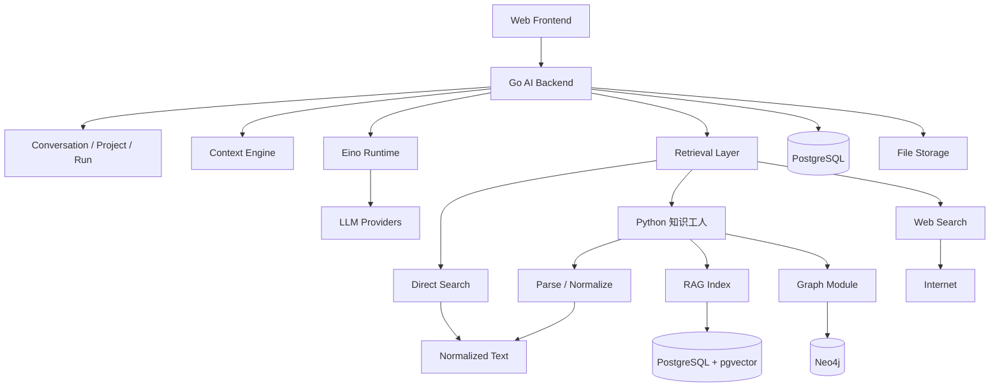
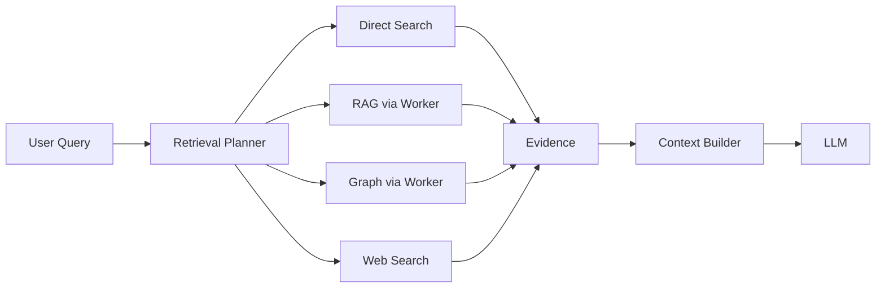
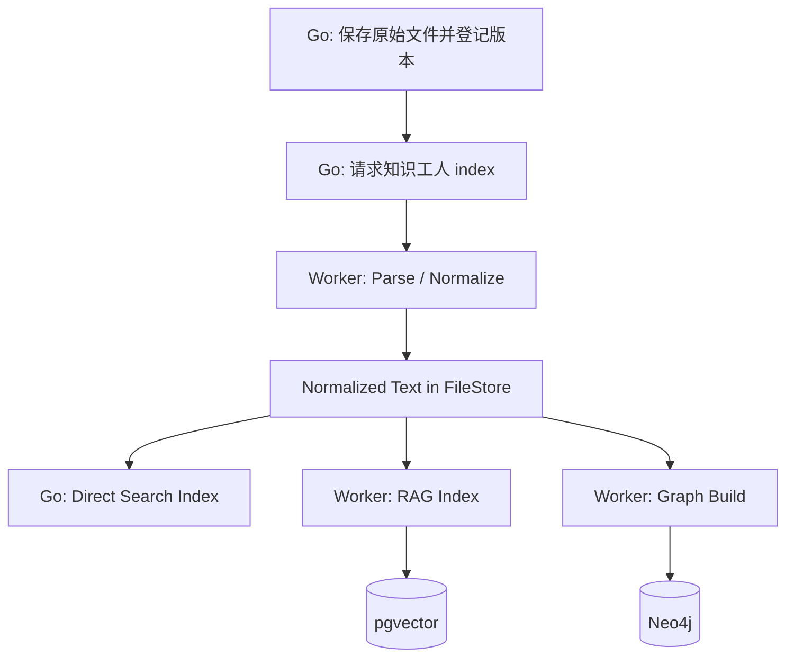

# 个人 AI Workspace｜总体架构

> 文档版本：1.2  
> 文档定位：只描述系统的大体架构、模块边界与核心数据流。  
> 本文不讨论数据库表、字段、详细接口、状态机或具体实现细节。  
> 1.2 变更：取消 M0～M4 分期；图谱纳入主体架构，仍作为知识工人内部模块。

---

## 1. 系统定位

项目整体是一个以 Go 为核心的个人 AI Workspace。对浏览器只有一个后端。

主要能力包括：

```text
Chat
会话管理
知识库
Direct Search
RAG
Knowledge Graph
Web Search
```

Go Backend 是唯一产品控制面。Python 知识工人是内部能力进程，不是第二个产品后端。Neo4j 是图存储。Agent 属于 P1，Sandbox 属于 P2，都不进入当前主体架构。

---

## 2. 总体架构



前端只访问 Go。Go 在需要语义检索或图谱时调用知识工人；精确搜索读标准化文本；联网搜索留在 Go 内。

---

## 3. 核心分层

```text
┌──────────────────────────────────┐
│          Web Frontend            │
├──────────────────────────────────┤
│       Go Application Layer       │  ← 唯一对外 API
├──────────────────────────────────┤
│   AI Orchestration / Context     │  ← Go + Eino
├──────────────────────────────────┤
│ Retrieval / Knowledge Worker     │  ← Direct / Web 在 Go；RAG / Graph 在 Python
├──────────────────────────────────┤
│ Data / Model / External Services │
└──────────────────────────────────┘
```

### Web Frontend

```text
Chat
Conversation
Knowledge
Sources
Graph View
Tool Status
```

### Go Application Layer

```text
Conversation
Project
Knowledge Metadata / 版本
权限
Run 控制
SSE
```

### AI Orchestration / Context

```text
LLM 调用
固定 Retrieval Workflow
Context Builder
Retrieval Planner
Citation 校验
```

### Retrieval / Knowledge Worker

```text
Direct Search     （Go，标准化文本）
Web Search        （Go）
Parse / RAG       （Python 知识工人）
Graph Query       （Python 知识工人）
```

### Data / External Services

```text
PostgreSQL + pgvector
File Storage
LLM Provider
Tavily
Neo4j
```

---

## 4. 四路检索架构

四种检索互补，由 Go 的 Retrieval Planner 选择或组合。



它们分别解决：

```text
Direct
→ 精确内容在哪里

RAG
→ 与问题语义相关的内容是什么

Graph
→ 实体之间有什么关系

Web
→ 外部和实时信息是什么
```

Planner 面向 Retriever 接口。RAG 与 Graph 的进程位置对 Planner 不可见。图谱未启用或构建失败时，Planner 必须明确跳过并让界面提示，不能改走旧图或伪装成功。

不要求每次都查四路。用户只选本地搜索时，不能因为结果少而自动联网。

---

## 5. 会话与 Context 架构

Conversation 由项目自身管理，不交给 Eino、LlamaIndex 或 Neo4j。

```text
Conversation / Run
    ↓
当前分支历史
+ Project Context
+ Retrieved Evidence
    ↓
Context Builder
    ↓
Eino / LLM
```

Context Engine 负责控制最终送给模型的信息。超长时优先保住当前问题、工具调用和工具结果的配对，再裁剪历史与证据。摘要不是原始文档证据。

同一会话同一时间只有一个活跃 Run。刷新或短断开不等于取消；重连只恢复已持久化内容和真实状态，不重复启动模型生成。

流式输出在结束前校验引用编号：模型编造的引用不能渲染成有效来源。

---

## 6. Knowledge 架构

原始文档只应被解析一次。Direct、RAG、Graph 都消费同一份标准化文本，并都能回到原文来源。



### 6.1 作业与版本

产品要求上传进度和解析进度分开，基础检索与图谱状态分开。对应的发布语义：

```text
接收     原始文件入 FileStore，状态=处理中；旧版本仍可被提问
标准化   写出 normalized 文本和真实定位元数据
基础索引 Direct + RAG 对同一文本可用后，新请求切到新版本
图谱索引 可落后、可失败；失败不得阻断普通问答
删除     新查询立即停用；缓存和引用详情不再泄露正文
```

合法状态例如：“文档问答可用，图谱构建中”。不能用旧版本图谱冒充新文档的关系。

### 6.2 进程边界

```text
Go
→ 文档 ID、所属用户、版本、原始文件、产品状态机

知识工人
→ 读原始文件，写标准化文本，建语义 / 图谱索引，按 ID 检索

双方
→ 挂载同一 FileStore；Python 不写会话，不自己做权限裁决
```

---

## 7. Eino 的位置

Eino 位于 Go Backend 内部的 AI Runtime 层。

```text
Go Business
    ↓
AI Runtime
    ↓
Eino
    ├── ChatModel
    ├── Workflow
    └── Tool Calling
```

Eino 不负责整个业务系统。普通数据库操作、会话管理、权限、知识库版本仍然使用普通 Go Service。

---

## 8. 普通问答

完整首版的普通问答走固定 Retrieval Workflow：Planner 调检索 → 融合证据 → 生成回答。

```text
Knowledge Retrievers
├── direct_search
├── rag_search
└── graph_search

Web Retrievers
├── web_search
└── web_fetch
```

多轮 Agent 属于 P1：再把上述能力以 Tool 形式交给 Eino。工具授权由系统决定，不由模型或网页指令扩大。Sandbox 相关 Tool 不属于当前架构。

---

## 9. 知识工人内部

```text
Go Backend
    ↓
Python 知识工人（一个进程）
    ├── Parse / Docling
    ├── RAG / LlamaIndex / pgvector
    └── Graph / neo4j-graphrag / Neo4j
```

RAG 只负责语义检索，不负责 Chat 或最终回答。Graph 只负责有来源的实体关系，必须能回溯 Document / Chunk。两者共享 Parse 产物，不互相复制一份私有语料。

---

## 10. Web Search 架构

```text
Go Backend
    ↓
Web Search Adapter（Tavily）
    ↓
Go Web Fetch
    ↓
Evidence
```

联网结果和本地知识都转换成统一 Evidence，再进入 Context Builder。仅有搜索摘要时必须标记“未读取正文”。

---

## 11. 一次请求的大体流程

```text
User
 ↓
Go：Conversation / Run
 ↓
Retrieval Planner
 ↓
Direct（本地标准化文本）
RAG / Graph（知识工人）
Web（若已授权）
 ↓
Evidence Fusion + Citation 校验
 ↓
Context Builder
 ↓
Eino / LLM
 ↓
SSE
 ↓
Conversation Persistence
```

文档上传是另一条异步链，不阻塞聊天；问答只使用当前已发布版本。

---

## 12. 最终架构总结

```text
                     React
                       ↓
                 Go AI Backend     ← 唯一产品后端
                       │
          ┌────────────┼────────────┐
          ↓            ↓            ↓
    Conversation    Context       Eino
                         │
                         ↓
                  Retrieval Planner
                         │
        ┌────────┬───────┼────────┐
        ↓        ↓       ↓        ↓
      Direct   Worker   Web     （Sandbox 不在当前图）
                 │
          Parse / RAG
          Graph
                 │
            pgvector / Neo4j
```

核心原则：

1. **对用户只有一个后端；实现上是 Go + 一个 Python 知识工人。**
2. **Eino 是编排组件，LlamaIndex / Neo4j 不接管 Chat。**
3. **Direct、RAG、Graph、Web 可组合，但都消费明确的证据，并进入同一个 Context Engine。**
